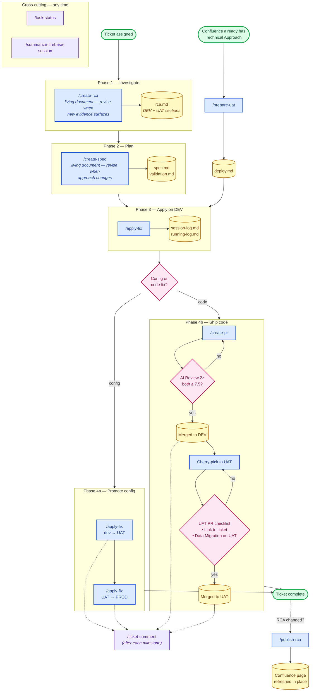

# InvoCare Skill Pipeline — Standard Workflow

> **Status:** Local draft. Not pushed to Confluence.
> **Template:** Adapted from [Technical Development Process](https://invocarecompass.atlassian.net/wiki/spaces/KMS2/pages/327280394265/Technical+Development+Process) (KMS2 space)

> **Purpose:** Define how the local skill pipeline under `.claude/skills/` implements the team's Technical Development Process for InvoCare tickets — which skill produces which artifact, where it is published, and how artifacts hand off across DEV → UAT → PROD.

---

## Overview

Every ticket follows the same skill sequence. Each skill produces a named artifact that the next skill in the pipeline consumes — the folder `tickets/{TICKET_KEY}/` is the local source of truth.

| # | Step | Skill | Artifact | Publish Location |
|---|---|---|---|---|
| 0 | Impact analysis (optional) | `/impact-analysis` | blast-radius map (local, planning aid) | informs the RCA / spec — nothing published |
| 1 | Root Cause Analysis | `/create-rca` | `tickets/{KEY}/rca.md` (incl. a **Steps to Reproduce** section) | Confluence (KMS2 space) via `/publish-rca` |
| 2 | Technical Approach | `/create-spec` | `tickets/{KEY}/spec.md` + `validation.md` | Jira ticket description |
| 3 | Reproduction steps | captured inside `/create-rca` (`rca.md` → Steps to Reproduce) | part of `rca.md` | — (no separate skill) |
| 4 | Apply on DEV | `/apply-fix` | `session-log.md` (run 1) + `deploy-result.md` + Firebase writes OR local code edits | Firebase DEV / Git repo |
| 5a | Promote (config path) | `/apply-fix` | `session-log.md` (run N+1) + Firebase writes | Firebase UAT, then PROD |
| 5b | Ship (code path) | `/create-pr`, then `/pr-code-review-fixer` to address PR review comments | GitHub PR on `ivc.ghe.com` | DEV branch, then cherry-pick to UAT |
| 6 | Communicate | `/ticket-comment` | Jira comment body (FULL QA-handoff, or `--short` progress checkpoint) | Jira ticket comment |
| 7 | Refresh RCA (conditional) | `/publish-rca` | Updated Confluence page | Confluence (KMS2 space) |

> **Reproduction steps** are not a separate skill or a `/ticket-comment` mode — they are captured inside `rca.md` (the **Steps to Reproduce** section) during Step 1, and carried into the QA-handoff comment at Step 5.

**Cross-cutting (any time):**
- `/impact-analysis {KEY}` — read-only blast-radius map of the code + config a ticket will touch, before committing to a technical approach
- `/task-status {KEY}` — read all artifacts + Jira + git, route to next skill
- `/summarize-firebase-session` — audit every Firebase write made in the current conversation
- `/prepare-uat` — alternative entry: pull an existing Technical Approach from a Jira-linked Confluence page and generate a UAT deploy file directly (skips local RCA/spec creation)

**Maintenance (not part of a ticket's flow):**
- `/sync-skills` — pull/publish the local `.claude/` skill tree against the shared Drive folder (provide the folder URL/id each run)

---

## Workflow Diagram

> **Revision pattern:** the *"living document"* annotation on `/create-rca` and `/create-spec` means either skill can be re-run when a later phase surfaces a gap. See the **Revision triggers** table below for which phase sends you back to which skill. No feedback arrows are drawn on the main diagram so the forward flow stays scannable.

**Legend**

| Color | Role | Examples |
|---|---|---|
| 🟢 Green | Entry / end terminals | `Ticket assigned`, `Ticket complete` |
| 🔵 Blue | Skill (action you invoke) | `/create-rca`, `/apply-fix`, `/create-pr` |
| 🟡 Yellow | Artifact (file or merged state) | `rca.md`, `session-log.md`, `Merged to DEV` |
| 🌸 Pink | Decision gate | `Config or code fix?`, `Both ≥ 7.5?`, `UAT PR checklist` |
| 🟣 Purple | Communication / cross-cutting | `/ticket-comment`, `/task-status`, `/summarize-firebase-session` |

**Revision triggers** — when to walk a dashed edge back:

| From | Back to | Trigger |
|---|---|---|
| `/create-spec` (Phase 2) | `/create-rca` (Phase 1) | Drafting the spec reveals an open question or missing evidence in the RCA |
| `/apply-fix` (Phase 3) | `/create-spec` (Phase 2) | Applying on DEV reveals a path/config the spec didn't cover |
| `/apply-fix` (Phase 3) | `/create-rca` (Phase 1) | Applying on DEV reveals the diagnosed root cause was wrong |
| AI Review gate (Phase 4b) | `/create-spec` (Phase 2) | PR review surfaces a finding that requires changing the planned approach |
| `/apply-fix` UAT (Phase 4a) | `/create-spec` (Phase 2) | UAT migration reveals an env-specific gap the spec didn't anticipate |

When you walk a dashed edge back: re-run the upstream skill (`/create-rca` or `/create-spec`) to refresh the artifact, then continue forward from where you stopped. The local artifact is the source of truth — downstream skills re-read it automatically.

---

## Step 1: Root Cause Analysis (RCA)

### What to do

Run `/create-rca {TICKET_KEY}` (auto-invokable when the model sees `GEN-XXXX`, `FIR-XXXX`, etc.). The skill investigates Jira + Firebase + Elasticsearch + the codebase and produces a structured RCA.

### Requirements

- The RCA is investigated against the environment the ticket refers to (**default `dev`**; switch to `uat`/`prod` only when the ticket says the issue occurs there). The header carries a **Currency** classification (`CURRENT` / `PARTIALLY_STALE` / `OUTDATED`) so a later run can tell whether the evidence is still live — it is not a fixed DEV+UAT pair of sections.
- Every evidence row in `rca.md` must specify the `DB` column (`RTDB` or `Firestore`) — per `.claude/rules/firebase-safety.md`, the project has two databases and paths often look identical across them.
- Every factual claim must cite a queried value. If a value is missing, state `not found` rather than guessing. Unresolved items go in an `## Open Questions` section, which blocks `/create-spec` until resolved.

### Where it lives

- Local: `tickets/{TICKET_KEY}/rca.md`
- Published: Confluence page in the KMS2 space, created or refreshed via `/publish-rca`.

### Maintenance

- Re-run `/create-rca {KEY}` when new evidence surfaces — the skill detects and refreshes outdated sections.
- After any RCA update, run `/publish-rca {KEY}` to refresh the Confluence page in place (preserves URL).

---

## Step 2: Technical Approach

### What to do

Run `/create-spec` after `rca.md` exists. The skill turns the RCA into a concrete fix plan with deployment steps and rollback.

### Requirements

- `spec.md` is written **environment-reusable** with `{ENV}` placeholders, plus an **Environment Mapping** table classifying every path as `STABLE` (identical across dev/uat/prod) or `ENV_SPECIFIC` (auto-generated IDs that differ per env, with a lookup query to resolve the target-env ID). This replaces hardcoded DEV/UAT sections so one spec deploys to any environment.
- Each step must be self-contained: paste paths inline, never link to local files (per `.claude/rules/output-guardian.md`).
- Companion `validation.md` enumerates the **Verification Steps** — concrete commands or UI paths that confirm the fix works.
- Reference [GEN-2737](https://invocarecompass.atlassian.net/browse/GEN-2737) for the canonical Expected Result / Verification Steps format.

### Where it lives

- Local: `tickets/{TICKET_KEY}/spec.md` + `validation.md`
- Posted: Jira ticket description (manual paste from `spec.md` — no skill auto-posts to Jira description today).

### Maintenance

- Re-run `/create-spec` whenever the approach changes — the skill self-checks via the spec-checker subagent.

---

## Step 3: Reproduction Steps

> Not a separate skill. `/ticket-comment` has **no "repro mode"** — it produces the FULL QA-handoff comment or, with `--short`, a progress checkpoint. Reproduction steps are captured inside `rca.md` (the **Steps to Reproduce** section) during Step 1, and carried into the QA-handoff comment at Step 6.

### What to do

While running `/create-rca`, populate the **Steps to Reproduce** section of `rca.md` so any team member can follow it.

### Requirements

- Environment (the env the ticket refers to)
- Pre-conditions (which client, quote, invoice, or template)
- Exact navigation path in the CRM
- Expected result vs. actual result
- If unreproducible: document what was tried and the outcome.

### Where it lives

- The **Steps to Reproduce** section of `tickets/{TICKET_KEY}/rca.md`; surfaced to QA via the Step 6 comment.

---

## Step 4: Apply on DEV

### What to do

Run `/apply-fix {TICKET_KEY}` after `spec.md` is reviewed. The skill executes the deployment steps against DEV Firebase (config path) or applies local code edits (code path).

### Requirements

- Per `.claude/rules/firebase-safety.md`: every Firebase write creates a session via `create_session`, the `session_id` is logged to `running-log.md` BEFORE the first write, and `session-log.md` records every path written + the pre-state value.
- Each individual write is shown to the user and confirmed before execution. No batch confirms.
- After the write, run `validation.md` checks against DEV to confirm the fix landed.

### Where it lives

- `tickets/{TICKET_KEY}/session-log.md` — per-ticket cumulative log of every run (apply / revert / re-apply)
- `sessions/running-log.md` — central index of every `session_id` created in this conversation, across all tickets

---

## Step 5a: Promote (config path)

### What to do

Run `/apply-fix {TICKET_KEY} uat` then `/apply-fix {TICKET_KEY} prod` to promote a Firebase-config fix DEV → UAT → PROD. Each apply is a new run in `session-log.md` with its own `session_id` (independent rollback handle).

### Requirements

- IDs differ across environments (RTDB keys, Firestore doc IDs) — the skill resolves the target-env ID before writing.
- Pre-flight checker validates target paths via the `pipeline-checker` subagent (read-only, per `.claude/rules/agents-safety.md`).
- After each environment lands, run `/ticket-comment` to post the UAT-applied or PROD-applied status to Jira.

### Where it lives

- New `## Run N` entry in `tickets/{TICKET_KEY}/session-log.md`
- New row in `sessions/running-log.md`

---

## Step 5b: Ship (code path)

### Review Policy

- Every pull request targeting **DEV** must go through the AI review workflow, triggered **twice**, before it can be merged.
- The **acceptable score is 7.5 or higher** on both runs. If either run scores below 7.5, address the feedback and re-run.
- `/create-pr` runs the lessons-corpus review (`code-lesson` MCP) as Step 1 of the skill — score-threshold enforcement is a manual gate today; verify both runs score ≥ 7.5 before merging.
- Once merged to DEV, cherry-pick to UAT **without re-running the review**.

### Addressing review comments

When a reviewer (or the AI review) leaves comments on the PR, run `/pr-code-review-fixer` to triage and apply them. It enforces minimal, logic-preserving edits, gathers evidence (reposphere / firebase-explorer / code-lessons) before classifying each comment into safe-to-fix vs. escalation-required, and treats refusal as a first-class outcome. It accepts a GitHub PR (number/URL/branch), a manager-hub CUID, or a local `code-review-result.json` from the in-repo `pr-reviewer` agent.

### UAT Pull Request Checklist

When opening a UAT PR (cherry-picked from DEV), the PR description must include:

- [ ] **Link to the ticket** — Jira URL in the PR description
- [ ] **Data Migration on UAT** — the ticket has a Technical Approach for UAT (covering any required data migration, config changes, or environment-specific steps)

`/create-pr` pre-checks the migration box automatically when `session-log.md` contains successful Firebase writes — meaning a migration was performed for this ticket.

### Where it lives

- GitHub Enterprise PR on `ivc.ghe.com` under `FireHawk/<repo>`
- Commit history references the ticket key (`feat(GEN-XXXX): ...` or `fix(GEN-XXXX): ...`)

---

## Step 6: Communicate

Run `/ticket-comment {TICKET_KEY}` after each pipeline milestone:

| Trigger | Comment template |
|---|---|
| DEV fix applied | "Applied on DEV — ready for SQA verification" |
| UAT migration / PR | "Migrated to UAT — ready for stakeholder check" |
| PROD applied | "Applied on PROD" |

All comments must respect `.claude/rules/output-guardian.md` — no tool names, no session IDs, no MCP references in the body.

---

## Step 7: Refresh RCA (conditional)

Only when `rca.md` has been edited after the Confluence page was last published:

- Run `/publish-rca {TICKET_KEY}`
- The skill detects an existing page and updates in place (URL preserved). For new tickets, it creates a new page.

This is **not** a routine terminal step — most tickets publish the RCA once and never need a refresh.

---

## Alternative Entry: `/prepare-uat`

When a teammate has already documented the Technical Approach on Confluence (linked from a Jira comment), `/prepare-uat` reads that page directly and generates a UAT `deploy.md` ready for `/apply-fix`. No local `rca.md` / `spec.md` required.

Triggers on: `prepare uat`, `deploy uat`, `build deploy.md from comment`, `generate UAT deploy from focusedCommentId`.

---

## Cross-cutting skills

| Skill | When to use |
|---|---|
| `/impact-analysis {KEY}` | Before writing a technical approach — read-only blast-radius map of the code + config a ticket will touch ("what does this touch?", "is this plan safe?") |
| `/task-status {KEY}` | Daily standup, return-after-time-away, "where am I on GEN-XXXX?" |
| `/task-status all` | Overview across every open ticket folder |
| `/summarize-firebase-session` | Audit every Firebase session created in the current conversation — uses `sessions/running-log.md` as the index |
| `/sync-skills` | Maintenance — pull/publish the local `.claude/` skill tree against the shared Drive folder (provide the folder URL/id each run) |

---

## Reference

- **Global rules:** `.claude/rules/` — `output-guardian.md`, `firebase-safety.md`, `secrets-safety.md`, `git-safety.md`, `agents-safety.md`, `code-search.md`, `sdlc-gates.md`, `code-comments.md`, `engineering-conduct.md` (all imported by `CLAUDE.md`)
- **Maintainer guide:** `.claude/skills/CONTRIBUTING.md` (current pipeline diagram + edit conventions)
- **Checker contract:** `.claude/skills/_shared/contracts/checker-contract.md` — all subagent verdict JSON schemas
- **Expected Result / Verification Steps format:** [GEN-2737](https://invocarecompass.atlassian.net/browse/GEN-2737)
- **Source template:** [Technical Development Process](https://invocarecompass.atlassian.net/wiki/spaces/KMS2/pages/327280394265/Technical+Development+Process) — KMS2 Confluence space
