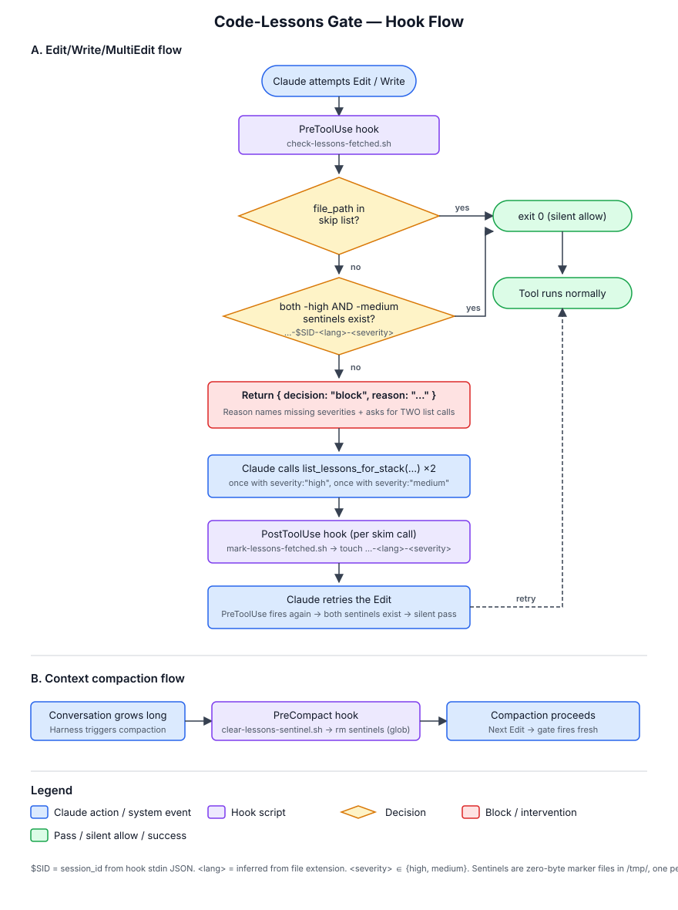

# Code-Lessons Gate

A three-hook system that enforces "skim code-lessons at BOTH `high` AND `medium` severities before non-trivial edits" exactly **once per (language, severity) pair per session**, with zero ongoing spam.

## Why this exists

`CLAUDE.md` mandates a `mcp__code-lessons__list_lessons_for_stack` skim once per task before editing code — and **per language**, never as a union call, with **two calls per language** because severity filtering is exclusive (`high` returns only high-tagged lessons, `medium` returns only medium-tagged). Getting Claude to actually do this reliably is tricky:

- **`CLAUDE.md` alone** is loaded once at session start; attention drifts in long conversations.
- **`UserPromptSubmit` hooks** miss subagents and don't fire for mid-task pivots.
- **Always-on reminders** waste tokens and trigger banner blindness.
- **A single severity call** silently drops the other corpus and is the most common failure mode.

This system fires the reminder **at the moment of risk** (about to edit code), and only once per (language, severity) per session.

## Components

| File                            | Hook event    | Matcher                                                | Role                                                                                                                                |
| ------------------------------- | ------------- | ------------------------------------------------------ | ----------------------------------------------------------------------------------------------------------------------------------- |
| `check-lessons-fetched.sh`      | `PreToolUse`  | `Edit\|Write\|MultiEdit`                                | Infers language from `file_path`. Blocks until BOTH `-high` AND `-medium` sentinels exist for that (session, language); silent thereafter. |
| `mark-lessons-fetched.sh`       | `PostToolUse` | `mcp__code-lesson-kms__list_lessons_for_stack`         | Reads `tool_input.language` and `tool_input.severity` and writes the matching per-(session, language, severity) sentinel for `high`/`medium`. |
| `clear-lessons-sentinel.sh`     | `PreCompact`  | _(no matcher)_                                         | Deletes all per-session sentinels (glob) before compaction, forcing fresh re-skims at both severities.                              |

All three are wired in `.claude/settings.json`.

## Flow



### Walkthrough

1. Claude attempts an `Edit`, `Write`, or `MultiEdit`.
2. `PreToolUse` fires → `check-lessons-fetched.sh` runs.
3. It reads `tool_input.file_path`. If it matches the skip list → `exit 0`, silent.
4. Otherwise it infers a `language` from the file extension (`.ts` → `typescript`, `.swift` → `swift`, …). Unknown extensions → `exit 0`, silent.
5. It checks both `/tmp/claude-lessons-fetched-<session_id>-<language>-high` and `…-<language>-medium`:
   - **Both exist** → `exit 0`, tool proceeds silently.
   - **Either missing** → emits `{ "decision": "block", "reason": "…" }` naming the missing severities, plus the monorepo stack catalog and a bulk-skim directive (see below).
6. Claude reads the block reason and calls `mcp__code-lesson-kms__list_lessons_for_stack(...)` **twice** per stack — once with `severity: "high"`, once with `severity: "medium"` (add `"critical"` on security-sensitive paths).
7. `PostToolUse` fires on every skim call → `mark-lessons-fetched.sh` touches one `…-<language>-<severity>` sentinel per (language, severity) pair (only `high`/`medium` are tracked; `critical`/`low` are ignored).
8. Claude retries the Edit. `PreToolUse` fires again, finds both sentinels, exits silently.
9. Every subsequent `Edit`/`Write`/`MultiEdit` in any already-skimmed (language, both-severities) pair passes silently. A first edit in a *new* language triggers the gate again — and a partial skim (only one severity) still blocks.

**Net cost in typical use:** one block per task, regardless of how many stacks the task touches (because the block reason prompts a bulk skim at both severities upfront).

## Bulk-skim on first gate

The block reason isn't just "skim the current language" — it names the missing severities, lists the monorepo's common stacks, and asks Claude to identify every stack the task will touch and skim them all at both severities upfront:

```
Pre-implementation gate (language=typescript): code-lessons skim incomplete this session.

CLAUDE.md requires TWO skim calls per language. Severity filtering is EXCLUSIVE:
  - severity: "high"   returns ONLY high-tagged lessons
  - severity: "medium" returns ONLY medium-tagged lessons
A single call CANNOT cover both. Running only "high" silently drops the entire medium corpus and counts as a gate failure.

Missing for typescript this session: high,medium

Before retrying, run BOTH calls (and add "critical" on security-sensitive paths):

  mcp__code-lessons__list_lessons_for_stack({ language: "typescript", frameworks: [...], severity: "high"   })
  mcp__code-lessons__list_lessons_for_stack({ language: "typescript", frameworks: [...], severity: "medium" })

- typescript + angular   → FCRM-Web, FCRM-Document-Signer, pdf-mapper
- typescript + nestjs    → Barndoor-Tributes-App
- typescript + express   → FCRM-Cloud-App, FCRM-Search-API, FCRM-Email-API
- typescript + firebase  → FCRM-Cloud-Functions, FCRM-Funeral-Services-API
- swift                  → Firehawk-CRM-iOS
- php                    → FCRM-Tributes-WP-Plugin
- twig                   → document-templates

Note: the sentinel keys on (language, severity), NOT on framework…
```

This converts the worst case from "N blocks per N stacks × 2 severities" into "1 block per task, then bulk-skim."

## Language inference

`check-lessons-fetched.sh` maps extensions to languages used by the `code-lessons` corpus:

| Extension(s)                          | Language       |
| ------------------------------------- | -------------- |
| `.ts`, `.tsx`                         | `typescript`   |
| `.js`, `.jsx`, `.mjs`, `.cjs`         | `javascript`   |
| `.py`                                 | `python`       |
| `.swift`                              | `swift`        |
| `.php`                                | `php`          |
| `.go`                                 | `go`           |
| `.rs`                                 | `rust`         |
| `.rb`                                 | `ruby`         |
| `.java`                               | `java`         |
| `.kt`, `.kts`                         | `kotlin`       |
| `.sh`, `.bash`                        | `bash`         |
| `.html`, `.htm`                       | `html`         |
| `.css`, `.scss`, `.sass`, `.less`     | `css`          |
| `.twig`                               | `twig`         |
| _other_                               | _exit silent_  |

Unknown extensions don't trigger the gate — we can't enforce what we can't classify.

## Framework dimension (and the same-language gap)

The sentinel keys on **(language, severity)**, not on `(language, frameworks, severity)`. This means:

- Editing FCRM-Web (`typescript + angular`) followed by Barndoor-Tributes-App (`typescript + nestjs`) only triggers the gate *once per severity* — the second edit silently passes even though the NestJS lessons were never skimmed.

Enforcing `(language, framework)` from a shell hook would require either:

- A manually maintained `.claude/stack-map.json` mapping each sub-project → its `(language, framework)` tuple (brittle, 30+ entries), or
- Hook-time inspection of each sub-project's `package.json` (fragile, frameworks overlap).

Both add maintenance debt for a gap that's bounded in practice. Instead, the block reason explicitly prompts about framework drift, and the rest is left to Claude's judgment per `CLAUDE.md`.

## Mid-task pivots

When a task discovers it needs to touch more stacks than initially planned, the gate behaves differently depending on what changed:

| Mid-task discovery                            | Hook behavior                                                              | What Claude must do                                          |
| --------------------------------------------- | -------------------------------------------------------------------------- | ------------------------------------------------------------ |
| New **language** appears (e.g. TS → Swift)    | Blocks — no sentinels for the new language                                 | Skim at both severities when prompted; nothing extra         |
| New **framework**, same language              | **Silent pass** — language+severity sentinels already exist                | Remember to skim the new framework combo on your own         |
| New language **and** new framework            | Blocks on the language; framework on Claude                                | Skim language at both severities when prompted; remember the framework |
| Only one severity previously skimmed          | Blocks — names the missing severity in the block reason                    | Run the other `list_lessons_for_stack` call before retrying  |

The framework-pivot case is the only one the hook can't catch — see the section above for why language is the only thing the bouncer can reliably check from a file path.

**Best defense: bulk-skim upfront.** The first time the gate fires, the block reason lists every monorepo stack and tells Claude to identify all stacks the task will touch before skimming. Done well, mid-task pivots rarely matter — the lessons are already in context. The warning in the block reason and the per-stack rule in `CLAUDE.md` are the backstop for when the upfront plan misses something.

## Skip list

The `PreToolUse` hook bypasses the gate entirely for these paths:

- **Docs**: `*.md`, `*.markdown`, `*.txt`, `*.rst`
- **Config / data**: `*.json`, `*.yaml`, `*.yml`
- **Lockfiles**: `*.lock`, `*/package-lock.json`, `*/yarn.lock`, `*/pnpm-lock.yaml`, `*/Gemfile.lock`
- **Tool config**: `*.gitignore`, `*.gitattributes`, `*.editorconfig`
- **Ticket writeups**: `*/tickets/*`

To add an extension, append a line to the `case` statement in `check-lessons-fetched.sh`.

## Compaction handling

When the Claude Code harness compacts context, structured lesson content can be summarized away even though the sentinels persist. `clear-lessons-sentinel.sh` runs on `PreCompact`, deletes every `/tmp/claude-lessons-fetched-<session_id>-*` sentinel (covering all language+severity combos via the glob), and the next edit per language triggers a fresh re-skim at both severities — full-fidelity rules back in context.

## Sentinel details

- **Path**: `/tmp/claude-lessons-fetched-<session_id>-<language>-<severity>` — zero-byte marker file, one per (session, language, severity)
- **Tracked severities**: `high` and `medium` only. `critical` and `low` skim calls are useful but not gated, so they don't write sentinels.
- **Lifetime**: created on each successful `list_lessons_for_stack` call for that (language, severity) pair; all sentinels for the session are cleared on `PreCompact` via the glob
- **Per-session**: subagents and the main session each have their own `session_id`, so they gate independently
- **Manual reset for one (language, severity)**: `rm /tmp/claude-lessons-fetched-<session_id>-<language>-<severity>`
- **Manual reset for all**: `rm /tmp/claude-lessons-fetched-<session_id>-*`

## Subagent coverage

The gate keys on tool calls (not on user prompts), so it covers subagents for free. A subagent spawned via the `Agent` tool runs in its own session — its own `session_id`, its own per-(language, severity) sentinels. The first time the subagent tries to `Edit`/`Write`/`MultiEdit` in any language, the same gate fires.

## Tuning knobs

| Want to…                                          | How                                                                                                  |
| ------------------------------------------------- | ---------------------------------------------------------------------------------------------------- |
| Add an extension to the skip list                 | Append to the first `case` in `check-lessons-fetched.sh`                                            |
| Add a language to the inference table             | Append to the second `case` in `check-lessons-fetched.sh`                                           |
| Update the bulk-skim stack catalog                | Edit the `reason` heredoc in `check-lessons-fetched.sh` (kept in-script for easy review)            |
| Skip trivial diffs (whitespace, comment-only)     | Inspect `tool_input.old_string` / `new_string` at the top of the script and `exit 0`                |
| Re-fire the gate after N minutes idle             | `find /tmp/claude-lessons-fetched-$SID-* -mmin +N -delete` before the existence test                |
| Add `critical` to the gated severities            | Extend the `case "$severity"` allowlist in `mark-lessons-fetched.sh` and the sentinel check in `check-lessons-fetched.sh` |
| Disable for one session                           | `for lang in typescript javascript swift…; do for sev in high medium; do touch /tmp/claude-lessons-fetched-<session_id>-$lang-$sev; done; done` |

## Files

```
.claude/
├── hooks/
│   ├── check-lessons-fetched.sh      # PreToolUse, blocks until -high AND -medium sentinels exist per (session, language)
│   ├── mark-lessons-fetched.sh       # PostToolUse, sets per-(session, language, severity) sentinel on list_lessons_for_stack
│   ├── clear-lessons-sentinel.sh     # PreCompact, glob-clears all session sentinels
│   ├── lessons-gate.md               # (this file)
│   └── lessons-gate.svg              # flow diagram
└── settings.json                     # wires the three hooks
```
